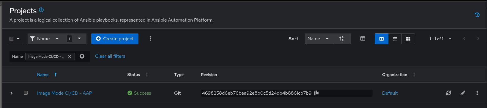
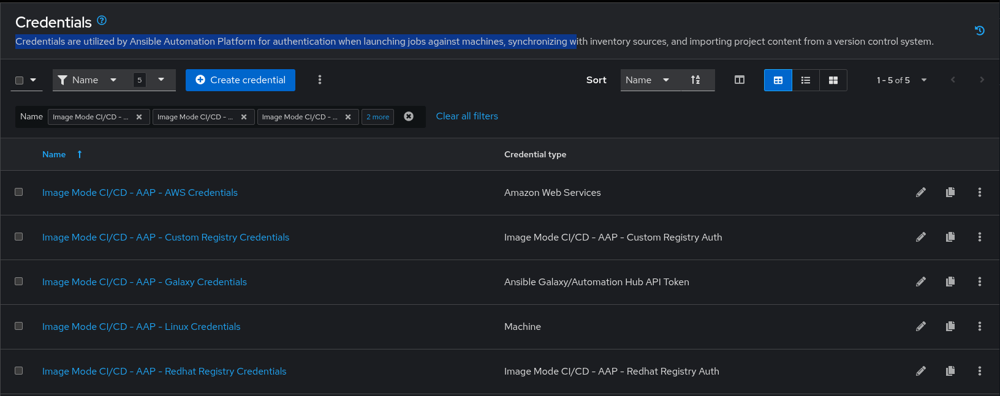
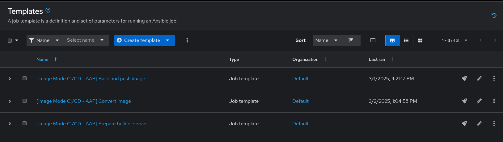

# RHEL Image mode - Ansible Automation Platform workflow to build and convert images

This repository contains playbooks to implement a simple RHEL Image Mode building and converting pipeline.

It comes with a configuration playbook and vars to set-up everything in Red Hat Ansible Automation Platform (projects, credentials, etc) to start working with it.

## Requirements

To work with this repo, you need:

- Ansible Automation Platform available
- One spare RHEL VM/server to use as a 'build host'

## Configuring AAP Controller

In the **demo-setup** folder, the following files are present:

| File Name | Description |
|-|-| 
| demo-setup-vars.yml | File with all variables (connection settings, credentials, etc.) |
| internal-vars.yml | File with internal variables (project definitions, credentials, templates, etc.) | 
| configure-aap-controller.yml | Playbook to set-up AAP Controller |
| configure-environment.yml | Wrapper for AAP Configuration and build server configuration | 

Below you can find the required vars and deaults:

| Variable                      | Description | Required | Default | 
|--------------------------------|-------------|----------|--------|
| `git_repository`              | URL of the project Git repository. | ✅ | https://github.com/kubealex/redhat-image-mode-aap |
| `redhat_registry_url`         | Red Hat Container Registry URL. | ✅ | registry.redhat.io | 
| `redhat_registry_username`    | Username for Red Hat Container Registry authentication. | ✅ | N/A |
| `redhat_registry_password`    | Password for Red Hat Container Registry authentication. | ✅ | N/A |
| `aap2_controller_url`         | URL of the AAP2 Controller. | ✅ | N/A |
| `aap2_controller_username`    | Username for AAP2 Controller authentication. | ✅ | N/A |
| `aap2_controller_password`    | Password for AAP2 Controller authentication. | ✅ | N/A |
| `aap2_organization`           | Organization name in AAP2 Controller. | ✅ | Default | 
| `automation_hub_url`          | URL of Red Hat Automation Hub. | ✅ | https://console.redhat.com/api/automation-hub/content/published/ | 
| `automation_hub_auth_url`     | Authentication URL for Red Hat Automation Hub. | ✅ | https://sso.redhat.com/auth/realms/redhat-external/protocol/openid-connect/token | 
| `automation_hub_token`        | Token for Red Hat Automation Hub authentication. | ✅ | N/A |
| `server_hostname`             | Hostname or IP of the server hosting builds. | ✅ | N/A |
| `server_username`             | Username for accessing the server. | ✅ | N/A |
| `server_password`             | Password for accessing the server. | ✅ | N/A |
| `custom_registry_url`         | URL of a custom registry to push/pull images to | ❌ | quay.io | 
| `custom_registry_username`    | Username for the custom registry. | ❌ | N/A |
| `custom_registry_password`    | Password for the custom registry. | ❌ | N/A |
| `aws_access_key`              | AWS access key for pushing AMIs (optional). | ❌ | N/A |
| `aws_secret_key`              | AWS secret key for pushing AMIs (optional). | ❌ | N/A |
| `aws_sts_token`              | AWS STS token for temporary credentials (optional). | ❌ | N/A |


You can then run the configuration playbook:

```bash
ansible-playbook configure-environment.yml -vv
```

And after the configuration you will end up with:

- A dedicated project (**Image Mode CI/CD - AAP**)



- A set of credentials (RH Registry,Custom Registry, Machine, etc.)



- Three job templates



## Running RHEL Image mode build

The template **[Image Mode CI/CD - AAP] Build and push image** will take care of building and pushing the image to the custom registry you are using.

It comes with a template that will prompt:

- Name of the image to build - **Only the image name is required, the full URL will be built based on the configuration - i.e. quay.io/kubealex/rhel-bootc-demo**
- List of tags to apply to the image - The format is a YAML list
- URL ofthe GIT repository where the Containerfile to build is

## Converting a RHEL Image mode container to an installation media

The template **[Image Mode CI/CD - AAP] Convert Image** will run all necessary steps to convert the container image to an installation/deploy media.

It comes with a template that will prompt:

- Name of the source image - **Only the image name is required, the full URL will be built based on the configuration - i.e. quay.io/kubealex/rhel-bootc-demo**
- Source image tag - The tag of the image to use as a bootc source
- Config.toml content - optional, to apply customizations, kickstarts, etc. By default it only adds a **sysadmin/redhat** user.
- Destination format - The output format, it now supports *qcow, ami, vmdk, raw, gcp, anaconda-iso*
- AWS Details - AMI Name, Bucket and region

In case of AWS AMI conversion, it will use the credentials specified in the configuration to perform the upload.

> [!IMPORTANT]
> The output of the conversion process is stored in the **/home/{{ ansible_user }}/rhel-image-mode/output** folder.


Maintainer: Alessandro Rossi - [alerossi@redhat.com](alerossi@redhat.com)
